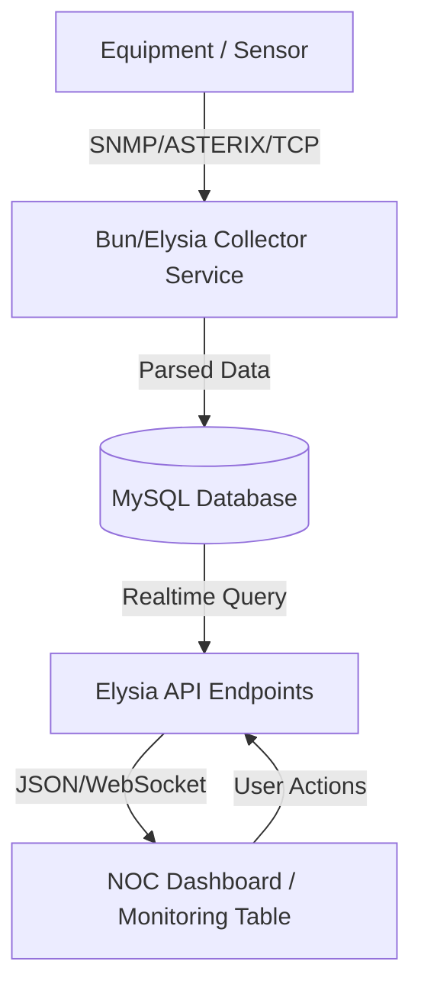

# ciko
Belajar sync repository pada github

# TOC (Technical Operation Center) Monitoring System

A professional, high-performance monitoring and management system for airport technical equipment (Navigation, Communication, Surveillance), built with a modern backend and realtime dashboard.

## 📋 Features

- **Realtime Monitoring**: NOC-style dashboard with live status updates.
- **Multi-Protocol Support**: SNMP (v2c), ASTERIX (Radar), and RCMS (Custom Parser).
- **Branch Management**: Advanced filtering by Airport and Category.
- **Technical Diagnostics**: Integrated Ping, SNMP Walk, and Data Capturing tools.
- **Reporting**: Automated logs with time-series data storage.

## 🛠️ Technology Stack

- **Runtime**: [Bun](https://bun.sh/) (Fast all-in-one JavaScript runtime)
- **Backend Framework**: [ElysiaJS](https://elysiajs.com/) (Ergonomic, high-performance Bun framework)
- **Database**: MySQL / MariaDB (Relational data & JSON logs)
- **Frontend**: HTML5, CSS3, Vanilla JavaScript (Modern ES6+)
- **Protocols**: 
    - **SNMP**: Device monitoring (v2c).
    - **ASTERIX**: Radar/Surveillance data parsing.
    - **RCMS**: Custom TCP/UDP data packet parsing.

## 📁 System Architecture



## 🗄️ Database Schema & Types

| Table | Column | Type | Description |
|-------|--------|------|-------------|
| **airports** | `id` | INT (PK) | Unique ID for Airport/Branch. |
| | `name` | VARCHAR(100) | Name of the airport. |
| | `city` | VARCHAR(100) | City location. |
| | `lat/lng`| DECIMAL | Geographic coordinates. |
| **equipment** | `id` | INT (PK) | Unique equipment ID. |
| | `code` | VARCHAR(50) | Unique equipment code. |
| | `category`| VARCHAR(50) | Navigation, Communication, etc. |
| | `snmp_config`| JSON | SNMP settings (IP, OID, Port). |
| **equipment_logs** | `id` | INT (PK) | Log entry ID. |
| | `equipment_id`| INT (FK) | Reference to equipment. |
| | `data` | JSON | Parsed technical parameters. |
| | `logged_at`| TIMESTAMP | Time of data capture. |
| **users** | `username` | VARCHAR(50) | Unique login name. |
| | `role` | VARCHAR(50) | Permission level (admin, teknisi, etc.). |

## 📖 Standard Operating Procedure (SOP)

### 1. Login & Authentication
- Access the application via browser at `http://localhost:3100`.
- Enter your **Username** and **Password**.
- Complete the simple Captcha verification.

### 2. Monitoring Equipment
- Use the **Dashboard** to see the overall health of system.
- Use the **Cabang (Branch)** menu for a detailed table-view of all devices.
- Green status indicates **Normal**, Red indicates **Alarm/Disconnect**.

### 3. Adding New Equipment
- Navigate to the **Management** section.
- Fill in the equipment details, location (Airport), and connection type.
- For SNMP devices, select the appropriate **Template** (e.g., DME, DVOR, MOXA).

### 4. Diagnostics & Troubleshooting
- Use the **Ping** button to test network connectivity.
- Use **SNMP Tools** to walk OIDs and verify specific sensor readings.
- Check **Equipment Logs** for historical trend analysis.

## 🚀 Getting Started (Bun)

### Installation
```bash
# 1. Clone repository
git clone <repo-url>

# 2. Install dependencies via Bun
bun install

# 3. Setup Database
# Import db/schema_mysql.sql and db/seed_snmp_templates.sql into your MySQL server.
```

### Running the App
```bash
# Start development server with auto-reload
npm run dev:bun
```
